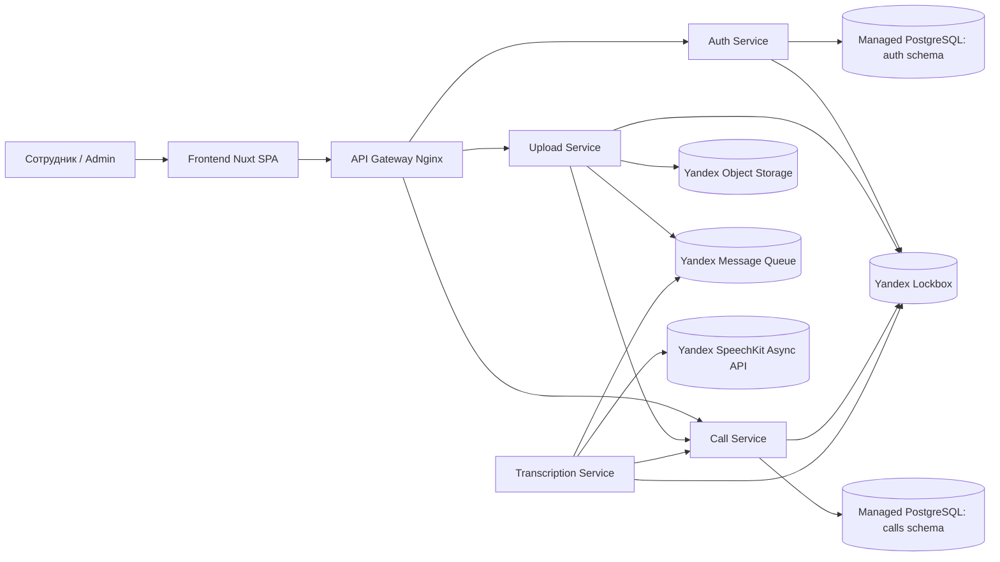
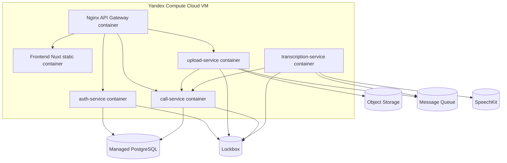
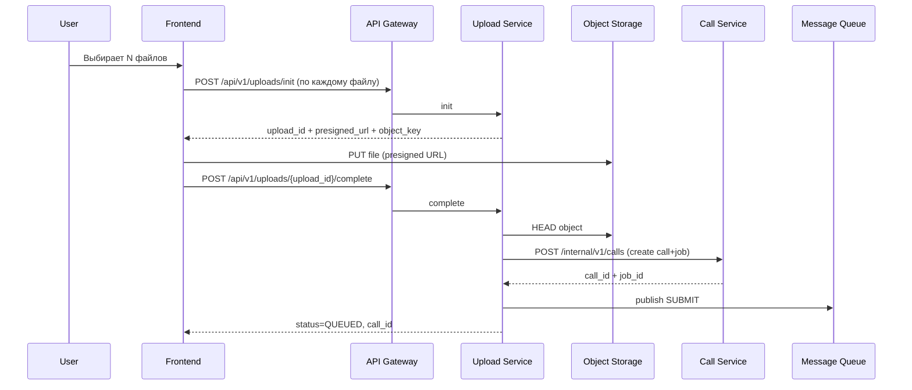
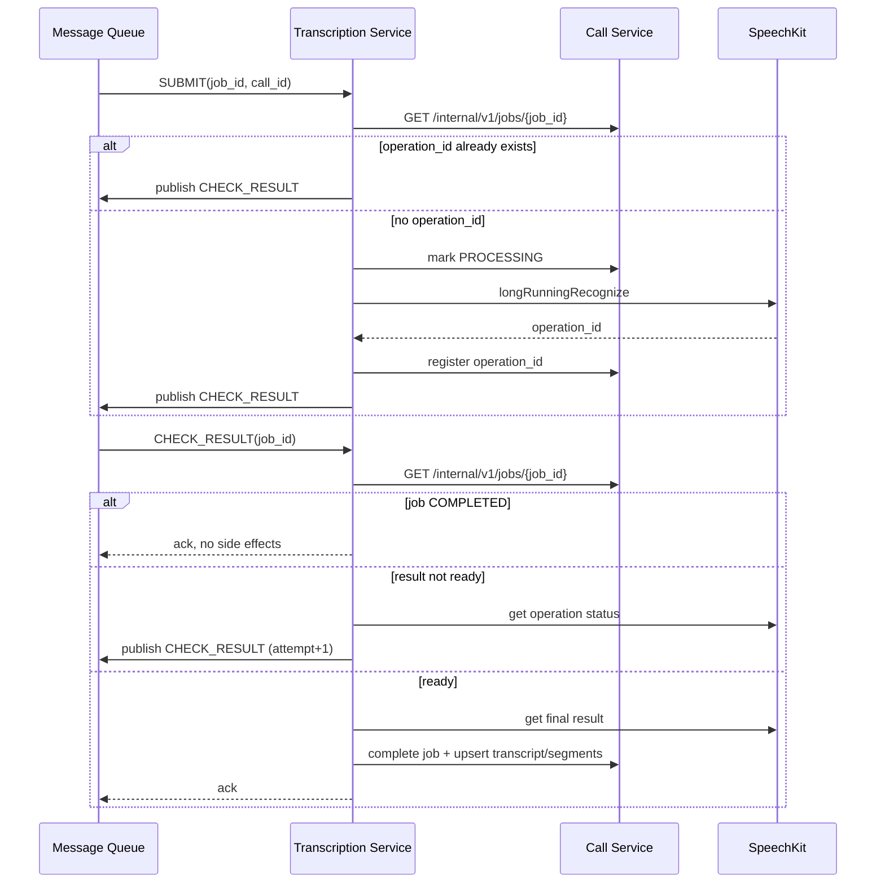

# Архитектура платформы транскрибации

## 1) Допущения

1. Система разворачивается как внутренний кабинет (intranet/VPN), публичный SEO не требуется.
2. Первый релиз запускается на одной VM в Yandex Compute Cloud с Docker Compose.
3. Внешние managed-сервисы (PostgreSQL, Object Storage, Message Queue, SpeechKit, Lockbox) уже доступны и управляются отдельно.
4. Для MVP допускается один кластер Managed PostgreSQL с разными схемами: `auth` и `calls`.
5. Пользователи создаются администратором, self-registration включается флагом `AUTH_REGISTRATION_ENABLED=true`.
6. Аудио хранится только в Object Storage; локальные диски контейнеров не используются для постоянных данных.
7. JWT access token проверяется локально каждым сервисом без сетевого вызова в auth-service.

## 2) Архитектурные решения

1. Микросервисное разделение по бизнес-возможностям: Auth, Upload, Call, Transcription, Frontend, API Gateway.
2. Асинхронная обработка транскрибации через Yandex Message Queue (SQS-совместимый API).
3. Upload-service не хранит файл у себя, а выдает presigned URL на прямую загрузку в Object Storage.
4. Call-service владеет жизненным циклом звонка и транскрипции (статусы, сегменты, retry/delete).
5. Transcription-service - отдельный долгоживущий worker-контейнер.
6. Все сервисы stateless: масштабируются горизонтально, конфиг через env, readiness/liveness endpoints.
7. Секреты получаются из Lockbox на старте (через env-поставщик/прелоадер), в коде не хранятся.

## 3) C1 (System Context)



## 4) C2 (Container / Deployment view)



## 5) Границы микросервисов

- `auth-service` владеет identity: users, refresh_sessions, роли, блокировка, смена пароля, admin user mgmt.
- `upload-service` владеет сценарием ingest: init/complete/abort загрузки, валидация object existence, постановка job в очередь.
- `call-service` владеет доменом звонков: calls, transcription_jobs, transcripts, transcript_segments, retry/delete/edit.
- `transcription-service` владеет orchestration с SpeechKit и message re-delivery/idempotency.
- `frontend` владеет UX и клиентской оркестрацией.
- `api-gateway` владеет маршрутизацией и единым входом.

Запрещено:
- прямые SQL-запросы между сервисами;
- общая бизнес-логика в общей библиотеке.

Допустимо:
- минимальная shared библиотека валидации JWT (инфраструктурный код).

## 6) API-контракты

### Auth Service

- `POST /api/v1/auth/login`
- `POST /api/v1/auth/refresh`
- `POST /api/v1/auth/logout`
- `GET /api/v1/auth/me`
- `PATCH /api/v1/auth/password`
- `GET /api/v1/admin/users`
- `POST /api/v1/admin/users`
- `PATCH /api/v1/admin/users/{user_id}`

### Upload Service

- `POST /api/v1/uploads/init`
- `POST /api/v1/uploads/{upload_id}/complete`
- `POST /api/v1/uploads/{upload_id}/abort`

### Call Service

- `GET /api/v1/calls`
- `GET /api/v1/calls/{call_id}`
- `DELETE /api/v1/calls/{call_id}`
- `POST /api/v1/calls/{call_id}/retry`
- `GET /api/v1/calls/{call_id}/audio-url`
- `GET /api/v1/calls/{call_id}/transcript`
- `PATCH /api/v1/calls/{call_id}/segments/{segment_id}`

### Internal межсервисные endpoints

- `POST /internal/v1/calls` (upload-service -> call-service)
- `POST /internal/v1/jobs/{job_id}/mark-processing` (transcription-service -> call-service)
- `POST /internal/v1/jobs/{job_id}/register-operation` (transcription-service -> call-service)
- `POST /internal/v1/jobs/{job_id}/complete` (transcription-service -> call-service)
- `POST /internal/v1/jobs/{job_id}/fail` (transcription-service -> call-service)
- `GET /internal/v1/jobs/{job_id}` (transcription-service -> call-service)

## 7) Модель данных

### Auth schema

- `users`
  - `id UUID PK`
  - `login VARCHAR UNIQUE`
  - `email VARCHAR UNIQUE NULL`
  - `password_hash TEXT`
  - `role ENUM(USER, ADMIN)`
  - `is_active BOOL`
  - `is_blocked BOOL`
  - `created_at TIMESTAMPTZ`
  - `updated_at TIMESTAMPTZ`

- `refresh_sessions`
  - `id UUID PK`
  - `user_id UUID FK users.id`
  - `token_hash TEXT`
  - `user_agent VARCHAR NULL`
  - `ip_address VARCHAR NULL`
  - `expires_at TIMESTAMPTZ`
  - `revoked_at TIMESTAMPTZ NULL`
  - `created_at TIMESTAMPTZ`

### Calls schema

- `calls`
  - `id UUID PK`
  - `owner_user_id UUID`
  - `owner_login VARCHAR`
  - `title VARCHAR`
  - `source_file_name VARCHAR`
  - `object_key VARCHAR UNIQUE`
  - `object_bucket VARCHAR`
  - `language VARCHAR`
  - `duration_seconds INT NULL`
  - `status ENUM(UPLOADING, QUEUED, PROCESSING, COMPLETED, FAILED)`
  - `progress INT`
  - `error_message TEXT NULL`
  - `uploaded_at TIMESTAMPTZ`
  - `created_at TIMESTAMPTZ`
  - `updated_at TIMESTAMPTZ`
  - `deleted_at TIMESTAMPTZ NULL`

- `transcription_jobs`
  - `id UUID PK`
  - `call_id UUID FK calls.id UNIQUE`
  - `status ENUM(QUEUED, PROCESSING, COMPLETED, FAILED)`
  - `attempt INT`
  - `operation_id VARCHAR NULL`
  - `last_error TEXT NULL`
  - `version INT` (optimistic lock)
  - `created_at TIMESTAMPTZ`
  - `updated_at TIMESTAMPTZ`

- `transcripts`
  - `id UUID PK`
  - `call_id UUID FK calls.id UNIQUE`
  - `full_text TEXT`
  - `language VARCHAR`
  - `created_at TIMESTAMPTZ`
  - `updated_at TIMESTAMPTZ`

- `transcript_segments`
  - `id UUID PK`
  - `transcript_id UUID FK transcripts.id`
  - `start_ms INT`
  - `end_ms INT`
  - `text TEXT`
  - `speaker_label VARCHAR NULL`
  - `confidence NUMERIC(5,4) NULL`
  - `segment_order INT`
  - `created_at TIMESTAMPTZ`
  - `updated_at TIMESTAMPTZ`
  - `UNIQUE(transcript_id, segment_order)`

## 8) Sequence diagram: загрузка



## 9) Sequence diagram: транскрибация



## 10) Структура monorepo

```text
transcription-platform/
  docs/
    architecture.md
    adr/
      ADR-001-nuxt-deployment.md
  infra/
    api-gateway/
      nginx.conf
      Dockerfile
  frontend/
    ... Nuxt 3 SPA ...
  services/
    auth-service/
    upload-service/
    call-service/
    transcription-service/
  libs/
    jwt-guard/
  docker-compose.yml
  README.md
```

## 11) SpeechKit integration baseline (фиксируем до реализации)

Интеграция реализуется с документированным async STT API (long-running recognition) Yandex SpeechKit:

- API family: STT async long-running recognition (`longRunningRecognize`) + Operations API polling.
- Аутентификация: IAM token в заголовке `Authorization: Bearer <token>`; в runtime используется auto-fetch через metadata service VM service account (или env fallback).
- Передача аудио: URI объекта в Yandex Object Storage (`https://storage.yandexcloud.net/<bucket>/<key>`).
- Результат запуска: `operation_id` из объекта operation.
- Проверка статуса: запрос в Operations API по `operation_id`.
- Временные метки: извлекаются из слов/чанков ответа, если возвращены API.
- Каналы: используем channel count из конфигурации запроса.
- Диаризация: если API/модель не возвращает спикеров, сохраняем `speaker_label = null`.

### SpeechKit recognition flags

- API version переключается флагом `SPEECHKIT_API_VERSION` (`v3` по умолчанию, fallback: `v2`).
- Для `v3` используются endpoint'ы:
  - `SPEECHKIT_V3_RECOGNIZE_FILE_ASYNC_URL` (`/stt/v3/recognizeFileAsync`)
  - `SPEECHKIT_V3_GET_RECOGNITION_URL` (`/stt/v3/getRecognition`)
  - Обязателен `SPEECHKIT_FOLDER_ID` (header `x-folder-id`).
- `textNormalization.textNormalization` (`SPEECHKIT_TEXT_NORMALIZATION_ENABLED`, default `true`) — включение/отключение нормализации текста.
- `textNormalization.literatureText` (`SPEECHKIT_LITERATURE_TEXT`, default `false`) — литературная нормализация.
- `textNormalization.profanityFilter` (`SPEECHKIT_PROFANITY_FILTER`, default `false`) — фильтрация нецензурной лексики.
- `speakerLabeling.speakerLabeling` (`SPEECHKIT_SPEAKER_LABELING_ENABLED`, default `true`) — включение разметки спикеров в `v3`.
- Для `v2` сохраняется поддержка `rawResults` (`SPEECHKIT_RAW_RESULTS`) и `audioChannelCount` только для LPCM/RAW.
- Для MP3/OggOpus `audioChannelCount` не форсируем: SpeechKit читает число каналов из контейнера.
- Поддерживаемые форматы в MVP: `wav`, `ogg` (`oggopus`), `mp3` - только после валидации pipeline и фактической совместимости модели.

Примечание: набор доступных кодеков/полей зависит от модели и версии SpeechKit. Конкретные поля запроса в коде вынесены в конфиг и могут быть сужены без изменения внешнего API.
